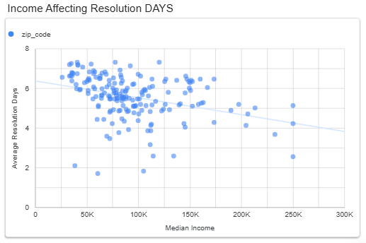
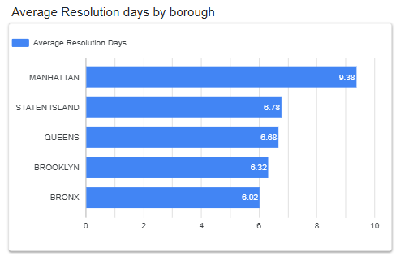
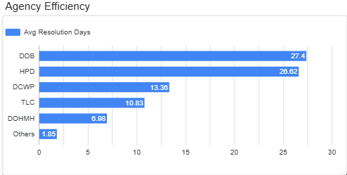
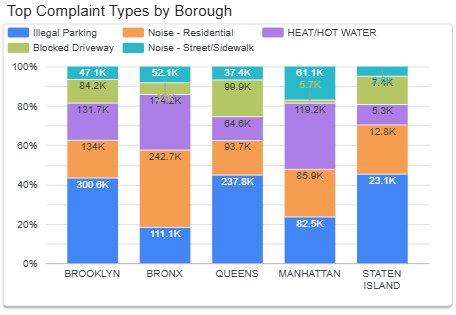
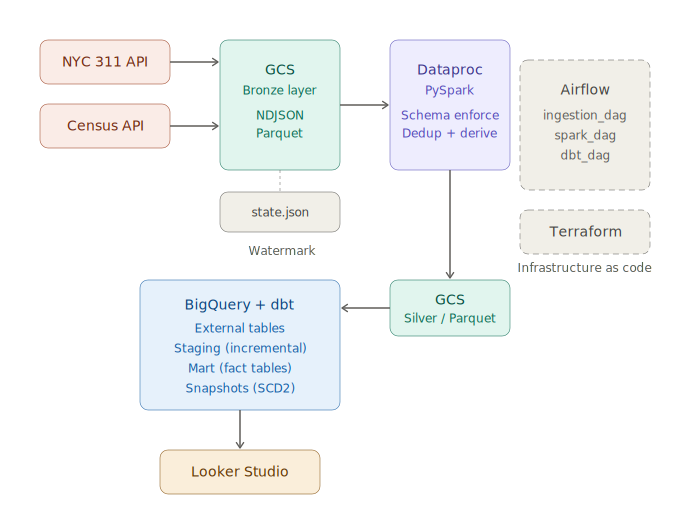

# NYC 311 Complaints — Service Equity Pipeline

## Problem Description

When a New Yorker calls 311 to report a pothole, a noise complaint, or a lack of heat in their apartment, how quickly the city responds should not depend on the income level of their neighborhood — but does it?

This project builds an end-to-end batch data pipeline that ingests all NYC 311 service requests from January 1, 2025 onwards alongside US Census median household income data by ZIP code. The goal is to measure whether there is a disparity in city service response times across income brackets. Specifically, the pipeline answers:

- **Do lower-income neighborhoods wait longer for complaint resolution?**
- **Which agencies are the slowest to resolve complaints, and where?**
- **What are the most common complaint types across boroughs, and how does income correlate with complaint patterns?**

The final output is an interactive Looker Studio dashboard that visualizes resolution time against median income at the ZIP code level, with breakdowns by borough, agency, and complaint type.

> **Key finding:** The scatter plot of median income vs. average resolution time shows a downward trend — lower-income ZIP codes tend to experience slightly longer resolution times. Manhattan, despite being the highest-income borough overall, has the longest average resolution time (9.38 days), likely driven by the volume of complex housing complaints handled by HPD and DOB.

### Dashboard

[View the live dashboard on Looker Studio](https://datastudio.google.com/reporting/b29d42de-5a9b-45ac-9acf-9b5e5e8ce00f)

The dashboard contains the following visualizations:

- **Income vs. resolution time scatter plot** — each dot is a ZIP code, plotted by median income (x-axis) against average resolution days (y-axis), colored by borough. A trendline reveals the income–response disparity. Filtered to ZIP codes with 0–10 day average resolution to remove low-volume noise and outliers for readability.



- **Average resolution days by borough** — horizontal bar chart showing which boroughs wait longest for service.



- **Agency efficiency** — horizontal bar chart ranking city agencies by average resolution time. DOB and HPD are the slowest at ~27 days.



- **Top complaint types by borough** — stacked bar chart showing the most common complaint categories and their distribution across boroughs.



### Data Sources

- **NYC 311 Service Requests (2025–present)** — [NYC Open Data (Socrata API)](https://data.cityofnewyork.us/Social-Services/311-Service-Requests-from-2010-to-Present/erm2-nwe9)
- **Median Household Income by ZIP Code** — [US Census Bureau, ACS 5-Year Estimates (2022), Table S1901](https://api.census.gov/data/2022/acs/acs5/subject)

> **Note:** The Census income data is from 2022 while the complaints are from 2025–2026. This ~3-year lag is a known limitation; income levels may have shifted, particularly in gentrifying neighborhoods.

---

## Architecture




### Data Flow

The pipeline runs daily as three sequential Airflow DAGs:

**1. Ingestion (`ingestion_dag` — 08:30 UTC)**

The ingestion script fetches records from the Socrata API using **watermark-based incremental loading**. A `state.json` file in GCS stores the last seen `:updated_at` timestamp. On each run, the script fetches only records where `:updated_at` is greater than the stored watermark, paginating in batches of 50,000 records. After all pages are fetched, the data is written as NDJSON to the GCS Bronze layer and the watermark is updated. This approach avoids full re-fetches and keeps daily runs fast after the initial load. The Census median income data is fetched in full (it's static) and stored as Parquet in Bronze.

Both tasks run in parallel as isolated Docker containers orchestrated by Airflow's `DockerOperator`.

**2. Transformation (`spark_transform_dag` — 12:30 UTC)**

An ephemeral Dataproc cluster (1 master + 2 workers) is created, runs PySpark transformations, and is deleted after completion — keeping costs near zero when the pipeline is idle. The Spark jobs:

- Read raw NDJSON from Bronze, enforce a strict schema, deduplicate records, and compute derived columns (`resolution_time_days`, `SLA_days`).
- Add `ingest_timestamp` and `ingest_date` columns, then write to the Silver layer as Parquet partitioned by `ingest_date`.
- Clean the Census income data (handle the `-666666` "no data" sentinel values, rename columns, cast types) and write to Silver as Parquet.

The transform uses file modification timestamps to detect new Bronze files since the last run, avoiding reprocessing of already-transformed data.

**3. Modeling (`dbt_dag` — 14:30 UTC)**

dbt creates BigQuery external tables pointing to Silver Parquet files, then builds staging and mart models:

- **Staging:** `stg_complaints` (incremental merge, deduplicated by `unique_key`) and `stg_median_income`.
- **Mart:** Three fact tables that power the dashboard — `fct_income_resolution`, `fct_agency_efficiency`, and `fct_complaint_hotspots`.
- **Snapshot:** `complaints_snapshots` captures SCD Type 2 changes on complaint records using the `updated_at` timestamp strategy.

---

## Tools & Technologies

| Component | Tool | Purpose |
|---|---|---|
| Cloud | Google Cloud Platform | All infrastructure runs on GCP |
| Infrastructure as Code | Terraform | Provisions GCS bucket, enables APIs, binds IAM roles |
| Orchestration | Apache Airflow (Docker Compose) | Schedules and runs 3 daily DAGs |
| Ingestion | Python + Docker | Fetches data from Socrata and Census APIs into GCS |
| Data Lake | Google Cloud Storage | Bronze (raw) and Silver (transformed) layers |
| Batch Processing | PySpark on Dataproc | Schema enforcement, deduplication, derived columns |
| Data Warehouse | Google BigQuery | External tables over Silver Parquet, staging + mart models |
| Transformation & Testing | dbt | Incremental models, data tests, snapshots |
| Dashboard | Looker Studio | Interactive equity analysis dashboard |
| Package Management | uv | Dependency management for Python services |

---

## Data Warehouse Design

### Partitioning & Clustering

The `stg_complaints` table in BigQuery is configured with:

- **Partitioned by** `created_date` (day granularity) — most dashboard queries filter by date range, so BigQuery only scans the relevant partitions instead of the full table. With 5M+ records spanning over a year of data, this significantly reduces query cost and latency.

- **Clustered by** `borough`, `complaint_type`, `incident_zip` — the three most common filter and group-by dimensions in the mart models. Clustering sorts data within each partition so that queries filtering on these columns read fewer blocks. For example, `fct_income_resolution` joins on `incident_zip` and groups by `borough`, so both operations benefit from clustering.

### Incremental Loading

The staging model uses dbt's `incremental` materialization with a `merge` strategy. On each run, only records with `ingest_date >= max(ingest_date)` from the existing table are processed. A `QUALIFY ROW_NUMBER()` window function deduplicates by `unique_key`, keeping only the latest version of each complaint based on `_updated_at`. This means the table always reflects the most current state of each complaint without reprocessing the full dataset.

### dbt Tests

Data quality is enforced through dbt tests that run after every staging build:

- **`unique`** and **`not_null`** on `unique_key` — ensures no duplicate or missing primary keys after deduplication.
- **`accepted_values`** on `status` — validates that all complaint statuses are one of: `open`, `closed`, `pending`, `in progress`, `assigned`, `started`, `unspecified`. Catches any unexpected status values introduced by API changes.
- **Custom test: `positive_median_income_test`** — asserts that no ZIP code has a negative total median income, guarding against data corruption in the Census source.

### dbt Snapshots

The `complaints_snapshots` snapshot tracks historical changes to complaint records using the **timestamp strategy** on the `updated_at` column. Each time a complaint's status, resolution, or other fields change, the snapshot captures the previous state with `dbt_valid_from` and `dbt_valid_to` timestamps. This creates a full SCD Type 2 history, enabling analysis of how long complaints sit in each status before resolution.

---

## Reproducibility — Setup Guide

### Prerequisites

- [Docker + Docker Compose](https://docs.docker.com/get-docker/)
- [Terraform](https://developer.hashicorp.com/terraform/install)
- [Google Cloud CLI (`gcloud`)](https://cloud.google.com/sdk/docs/install)
- A [GCP account](https://cloud.google.com/) with billing enabled
- A [Socrata app token](https://data.cityofnewyork.us/profile/edit/developer_settings) (free, required for higher API rate limits)

### 1. Clone the repo

```bash
git clone https://github.com/NomadG/nyc-complaints-pipeline.git
cd nyc-complaints-pipeline
```

### 2. GCP — Bootstrap (manual, one-time)

Terraform needs a service account to provision resources. Create one manually via the [GCP Console](https://console.cloud.google.com/) first:

1. **Enable APIs** — go to **APIs & Services → Library** and enable:
   - Cloud Resource Manager API
   - Identity and Access Management (IAM) API

2. **Create a service account** — go to **IAM & Admin → Service Accounts → Create Service Account**. Name it `terraform-runner`.

3. **Grant it the following roles** at the project level (**IAM & Admin → IAM → Grant Access**):
   - `Editor`
   - `Security Admin`
   - `Service Usage Admin`

4. **Download the key** — open the service account, go to **Keys → Add Key → Create new key → JSON**. Save the file as `g_creds.json` inside a `credentials/` folder in the repo root.

> The same service account is used for both Terraform provisioning and running the pipeline. Terraform (`iam.tf`) grants it `storage.admin`, `bigquery.admin`, and `dataproc.editor`.

### 3. Terraform — Provision GCP Infrastructure

```bash
cd terraform/
cp terraform.tfvars.example terraform.tfvars
```

Edit `terraform.tfvars` with your values:

```hcl
project_id            = "your-gcp-project-id"
region                = "us-central1"
location              = "US"
bucket_name           = "your-gcs-bucket-name"
credentials           = "/absolute/path/to/credentials/g_creds.json"
service_account_email = "terraform-runner@your-project-id.iam.gserviceaccount.com"
services = [
  "iam.googleapis.com",
  "cloudresourcemanager.googleapis.com",
  "storage.googleapis.com",
  "bigquery.googleapis.com",
  "bigquerystorage.googleapis.com",
  "dataproc.googleapis.com",
  "compute.googleapis.com",
]
```

```bash
terraform init
terraform plan
terraform apply
```

### 4. Enable Private Google Access

Dataproc cluster VMs need this to reach GCS and BigQuery.

```bash
gcloud compute networks subnets update default \
  --region=us-central1 \
  --enable-private-ip-google-access
```

### 5. Build Docker Images

```bash
# Ingestion image
cd ingestion/
docker build -t ingestion .
cd ..

# dbt image
cd dbt/
docker build -t dbt .
cd ..
```

### 6. Configure Airflow

```bash
cd airflow/
cp .env.example .env
```

Edit `.env` with your values. Generate the required keys:

```bash
# Generate FERNET_KEY
python -c "from cryptography.fernet import Fernet; print(Fernet.generate_key().decode())"

# Generate AIRFLOW__API__SECRET_KEY
python -c "import secrets; print(secrets.token_urlsafe(32))"
```

Key variables to set in `.env`:

| Variable | Description |
|---|---|
| `FERNET_KEY` | Encryption key (generated above) |
| `AIRFLOW__API__SECRET_KEY` | API auth key (generated above) |
| `AIRFLOW__API_AUTH__JWT_SECRET` | JWT secret for Airflow API auth (generated above) |
| `CREDENTIALS_HOST_DIR` | Absolute path to your `credentials/` folder |
| `GCS_BUCKET_NAME` | Your GCS bucket name |
| `SOCRATA_APP_TOKEN` | Your Socrata developer token |
| `DATAPROC_PROJECT_ID` | Your GCP project ID |
| `DATAPROC_REGION` | `us-central1` (or your chosen region) |

### 7. Start Airflow

```bash
cd airflow/

# First-time initialisation
docker compose up airflow-init

# Start all services
docker compose up -d
```

Airflow UI: `http://localhost:8080` (default credentials: `airflow` / `airflow`).

### 8. Run the Pipeline

The three DAGs run automatically on their daily schedule. To trigger a full run manually:

1. Open `http://localhost:8080`
2. Enable and trigger **`ingestion_dag`** — wait for it to complete
3. Enable and trigger **`spark_transform_dag`** — wait for it to complete
4. Enable and trigger **`dbt_dag`**

> **First run note:** The initial ingestion fetches all records since `DEFAULT_START` (2025-01-01 by default) and may take 60–90 minutes depending on dataset size. Subsequent daily runs only fetch new/updated records and complete in minutes.

> **Spark script:** `spark_transform_dag` automatically uploads `transforms.py` to GCS before each run — no manual upload needed.

---

## Project Structure

```
nyc-complaints-pipeline/
├── airflow/                        # Airflow Docker Compose setup
│   ├── dags/
│   │   ├── ingestion_dag.py        # Fetches data → GCS Bronze
│   │   ├── spark_transform_dag.py  # Bronze → Silver via Dataproc
│   │   └── dbt_dag.py              # Silver → BigQuery mart tables
│   ├── docker-compose.yaml
│   └── .env.example
├── ingestion/                      # Ingestion Docker image
│   ├── main.py                     # Socrata + Census API fetcher
│   └── Dockerfile
├── spark-tranformation/            # PySpark scripts
│   └── transforms.py               # Transformation logic (submitted to Dataproc)
├── dbt/                            # dbt project
│   ├── nyc_complaints/
│   │   ├── models/
│   │   │   ├── raw/                # External table definitions (sources.yml)
│   │   │   ├── staging/            # stg_complaints, stg_median_income
│   │   │   └── mart/               # fct_agency_efficiency, fct_complaint_hotspots, fct_income_resolution
│   │   ├── snapshots/              # SCD Type 2 complaint history
│   │   ├── tests/                  # Custom data quality tests
│   │   └── profiles.yml
│   └── Dockerfile
├── terraform/                      # Infrastructure as Code
│   ├── main.tf                     # GCS bucket
│   ├── apis.tf                     # GCP API enablement
│   ├── iam.tf                      # Service account IAM roles
│   ├── variables.tf
│   └── terraform.tfvars.example
└── credentials/                    # Gitignored — place g_creds.json here
```